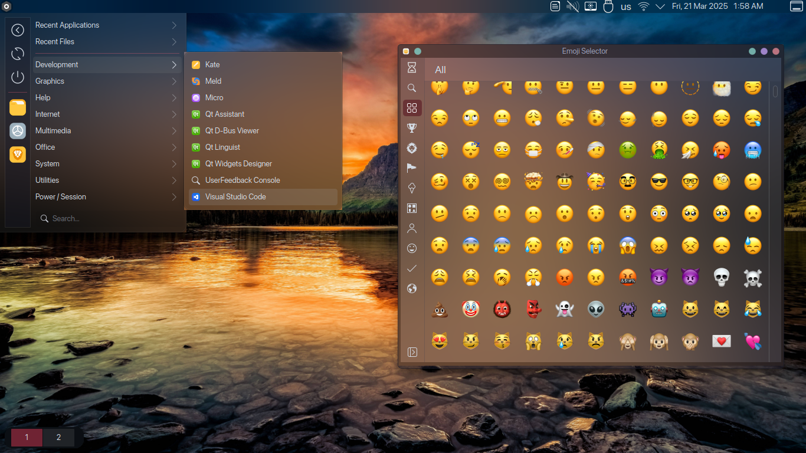
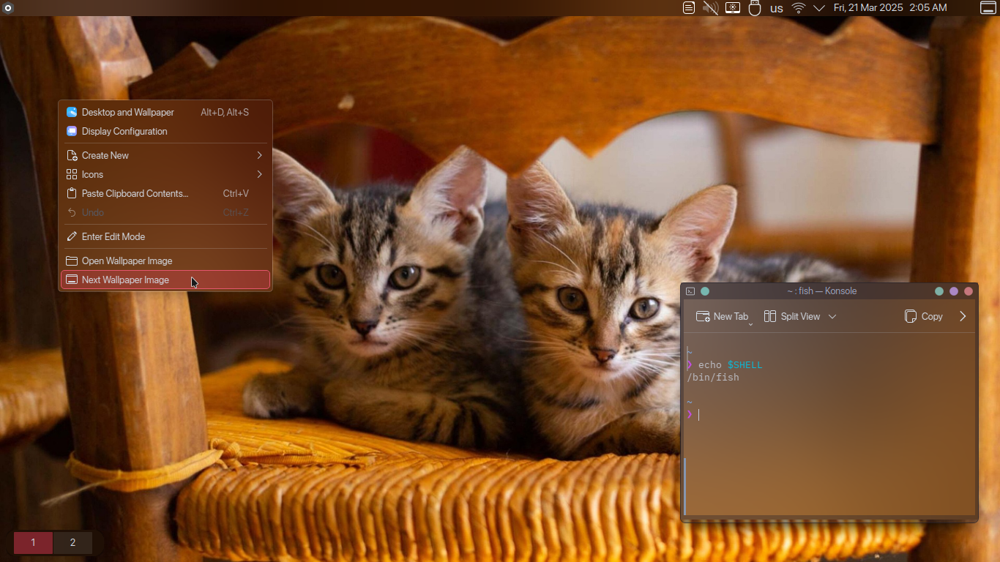
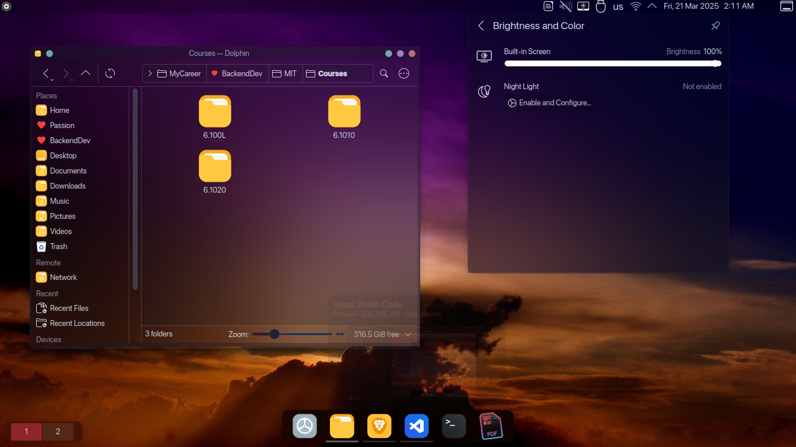
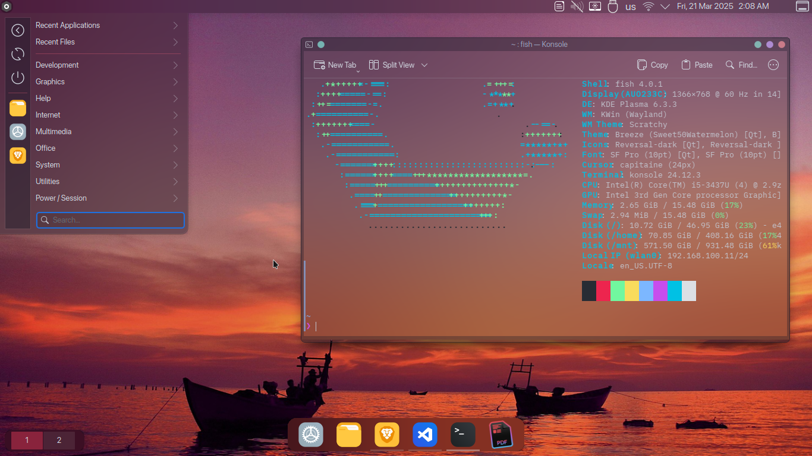

# My KDE Theme

Heavily inspired by PearOS, MacOS & CutefishOS

---

## Sections

- [MetaData](#metadata)
- [Screenshots](#screenshots)
- [Steps](#steps)

---

## Metadata

```
KDE_VERSION=6.3.3
```

---

## Screenshots






---

## Steps

**Note: Unless mentioned otherwise, run all the commands as a normal user (non-root), and keep the repo directory in `~` (aka `/home/$USER/`) directory for the ease of configuration**

### 1. Preparation

1. Clone this repo & enter the repo directory

```bash
cd ~
git clone https://github.com/nerd-airfryer/kde-theme
cd kde-theme/
```

### 2. Installing Fonts

1. Move the fonts to their directory

```bash
mv ~/kde-theme/dotfiles/assets/fonts/* ~/.local/share/fonts/
# if you get an error that the directory does not exist, run this command: mkdir -p ~/.local/share/fonts/ && echo "Great, now, re-run this command (without quotes): 'mv ~/kde-theme/dotfiles/assets/fonts/* ~/.local/share/fonts/'"
```

2. Apply the fonts
    1. Go to System Settings > Text & Fonts > Fonts
    2. Click `Adjust All Fonts` in the top middle then choose `SF Pro`
    3. Click on the pen icon next to `Fixed Width` font and change it to `Lilex Nerd Font`
    4. Click Apply in the bottom right

3. Add extra font-configurations

```bash
mv ~/kde-theme/dotfiles/configs/fonts/* ~/.config/fontconfig/conf.d/
# if you get an error that the directory does not exist, run this command: mkdir -p ~/.config/fontconfig/conf.d/ && echo "Great, now, re-run this command (without quotes): 'mv ~/kde-theme/dotfiles/configs/fonts/* ~/.config/fontconfig/conf.d/'"
```

### 3. Installing Better Blur Effect (Works best with transparent color schemes)

1. If you are using Arch, install it using `yay`

```bash
yay -S kwin-effects-forceblur
```

Otherwise, install it by building it, chack the [official repo](https://github.com/taj-ny/kwin-effects-forceblur) for installation

2. Go to System Settings > Window Management > Desktop Effects
3. Make sure `Blur` and `Background Contrast` are unchecked, and then check `Better Blur` and configure it as you like

### 4. Installing Color Schemes

1. Add color schemes to their directory

```bash
mv ~/kde-theme/dotfiles/assets/color-schemes/* ~/.local/share/color-schemes/
# if you get an error that the directory does not exist, run this command: mkdir -p ~/.local/share/color-schemes/ && echo "Great, now, re-run this command (without quotes): 'mv ~/kde-theme/dotfiles/assets/color-schemes/* ~/.local/share/color-schemes/'"
```

2. Go to System Settings > Colors & Themes > Colors, and you will find the color schemes you have added, apply any of them (for example: `Sweet 50 Watermelon`)

**Note: You will find the settings app got very annoying UI, don't worry, we will fix that (see [Extras](#9-extras))**

**Another Note: You may encounter flickering, inconsistency of colors or any other UI annoying, restart the machine and everything should be fixed, or in the mean time, swich color scheme to breeze and change it lastly before the big restart of everything**

### 5. Configure Application Style

1. Go to System Settings > Colors & Themes > Application Style and click on the pen icon next to breeze
2. Click on the `Transparency` tab
3. Set the transparency to the lowest

### 6. Configure Plasma Style

1. Add plasma styles to their directory

```bash
mv -r ~/kde-theme/dotfiles/assets/plasma-styles/* ~/.local/share/plasma/desktoptheme/
# if you get an error that the directory does not exist, run this command: mkdir -p ~/.local/share/plasma/desktoptheme/ && echo "Great, now, re-run this command (without quotes): 'mv -r ~/kde-theme/dotfiles/assets/plasma-styles/* ~/.local/share/plasma/desktoptheme/'"
```

2. Go to System Settings > Colors & Themes > Plasma Style
3. Apply `Iridescent-round-watermelon`

**Note: You can customize the internals of the style (colors / minimum panel height / etc) by editing the svgs in Inkscape**

### 7. Configure Window Decorations

1. Add window decorations to their directory

```bash
mv -r ~/kde-theme/dotfiles/assets/window-decorations/* ~/.local/share/aurorae/themes/
# if you get an error that the directory does not exist, run this command: mkdir -p ~/.local/share/aurorae/themes/ && echo "Great, now, re-run this command (without quotes): 'mv -r ~/kde-theme/dotfiles/assets/window-decorations/* ~/.local/share/aurorae/themes/'"
```

2. Go to System Settings > Colors & Themes > Window Decorations
3. Apply the `Scratchy` decoration

**Note: You can customize the internals of the decoration by editing the svgs in Inkscape**

### 8. Icons & Cursors 

Icons & Cursors are normally Customized from the System Settings, Heavy Customizations for Icons & Cursors are by changing the images at `~./local/share/icons/` (icons) and `~/.icons` (cursors). I am using `Reversal-dark` icon pack + `Capitine Cursors` for cursors

### 9. Desktop Panels

Apply 3 Panels

1. Panel 1 (bottom taskbar)
    1. Configs (bottom, center, width: fit-content, height: 56, color: translucent, visibility: auto hide, floating: true)
    2. Widgets (from left to right): "Applications-only Task Bar"
2. Panel 2 (Desktop Switcher)
    1. Configs (bottom, left, width: fit-content, height: 44, color: translucent, visibility: dodge-windows, floating: true)
    2. Widgets (from left to right): "Margins Separator" - "Pager" - "Margins Separator"
3. Panel 3 (Top Panel)
    1. Configs (top, center, width: full, height: 22, color: translucent, visibility: always visible, floating: false)
    2. Widgets (from left to right): "Application Menu" - "Global Menu" - "Spacer" - "System Tray" - "Margins Separator" - "Digital Clock" - "Margins Separator" - <u>"Application Title Bar"</u> - "Margins Separator" - "Minimize All Windows"

**Note Regarding Application Title Bar**: To install it, run this command

```bash
mv -r ~/kde-theme/dotfiles/assets/plasmoids/* ~/.local/share/plasma/plasmoids/
# if you get an error that the directory does not exist, run this command: mkdir -p ~/.local/share/plasma/plasmoids/ && echo "Great, now, re-run this command (without quotes): 'mv -r ~/kde-theme/dotfiles/assets/plasmoids/* ~/.local/share/plasma/plasmoids/'"
```

### 10. Extras

#### 1. Exclude an application from applying a color scheme

Motivation: While most of the KDE Applications have correct color theming, the Settings & Plasmashell Apps fallback background color

1. Get the application rc file position (thanks shalva97) [use this repo to locate its position](https://github.com/shalva97/kde-configuration-files), for the settings it's located in `~/.config/systemsettingsrc` and for plasmashell it's located in `~/.config/plasmashellrc`
2. Open the files
3. Open a **non-transparent** color scheme file (located in `~/.local/share/color-schemes/`), example `Sweet Watermelon` ✅ (NOT `Sweet 50 Watermelon` ❌)
4. Copy the contents of the color scheme and append it to each of the rc files

### 11. Finally

Reboot your device